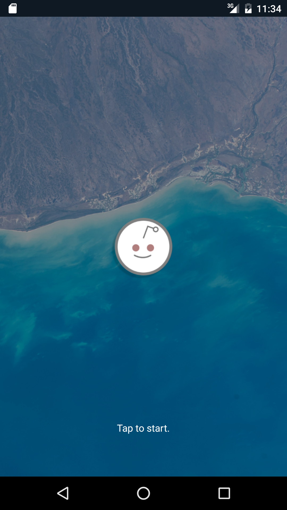

# Reader
Android application that grabs and displays the saved submissions for a Reddit user.  
Offers functionality to filter saved submissions.  
Showcases some of the features of reactive programming and basic principles of MVP.

## Installation
Install the following apk:  
<a href="https://github.com/JotraN/reader/raw/master/reader.apk">reader.apk</a> 
> 1. Copy the apk to your phone.
> 2. Make sure installing from 'Unknown sources' is enabled.
> 3. Open and install the apk on your phone.

You can also install this application by building it yourself in Android Studio:  
> 1. File -> Open...
> 2. Run -> Run 'app'

## Notable Libraries Used
<a href="https://github.com/thatJavaNerd/JRAW">JRAW (0.8.0)</a> 
<a href="https://github.com/ReactiveX/RxJava">RxJava (1.1.0)</a> 
<a href="https://github.com/ReactiveX/RxAndroid">RxAndroid (1.1.0)</a> 
<a href="https://github.com/orfjackal/retrolambda">Retrolamba (3.2.5)</a> 

## License
This project is licensed under the terms of the MIT license.
